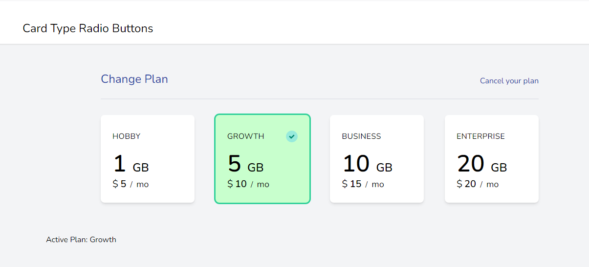

# Card Type Radio Button in Laravel Blade and Alpine.js
 > Card Type Radio Button - laravel Blade component - created with Laravel Blade and Alpine.js


## Screenshot


## Installation
> Create a new or use existing laravel installation
> Just copy the card-radio.blade.php file to your blade components folder and reference it with <x-card-radio></x-card-radio>

## Example
> Create a new file or copy example.blade.php to the 'views' folder
> Reference an endpoint in web.php
```
Route::get('/card-radio', function () {
        return view('example');
    });
```

## Customization
> Fully customisable - just change texts and options in the card-radio.blade.php file and call suitably. Reading the **example.blade.php** file shows options.

## Dependencies

  

## References

https://github.com/drehimself/custom-radio-buttons
